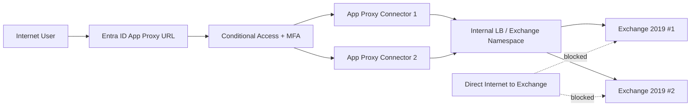

# Exchange Server 2019 OWA 真正 MFA（不可绕过）最佳实践实施方案

> 场景：两台 Exchange Server 2019，目标是在 OWA 上实现**真正 MFA**，并从网络与身份两侧确保无法绕过。

## 1. 关键结论（先说结论）

Exchange 2019 本身不提供可直接用于 OWA 的原生 MFA（不依赖外围网关）。
要做到“不可绕过”的 MFA，推荐方案是：

1. 使用 **Microsoft Entra Application Proxy（预身份验证）+ Conditional Access + MFA** 作为 OWA 外网入口。
2. 两台 Exchange 仅对内提供 OWA，外网**不直连 Exchange**。
3. 通过防火墙 / WAF / IIS IP 限制，仅允许来自 App Proxy 连接器（或上游反向代理）的流量到达 OWA/ECP。
4. 同步关闭或限制可绕过 MFA 的旧协议（如 Basic Auth 的残留、外网 EWS/ActiveSync/POP/IMAP 等视业务收敛）。

这样 MFA 发生在访问 OWA 之前，且网络路径上没有“直连后门”，才是实际安全意义上的强制 MFA。

---

## 2. 目标架构



---

## 3. 实施步骤（生产可落地）

## 3.1 Exchange 侧准备

1. 确认两台 CAS/MBX 虚拟目录 URL 一致（OWA/ECP/ActiveSync 等按需整理）。
2. 仅保留现代认证相关配置，清理不必要的外网发布端点。
3. TLS 使用有效证书（内外命名策略一致）。

示例检查命令（手工执行）：

```powershell
Get-OwaVirtualDirectory | fl Server,InternalUrl,ExternalUrl,FormsAuthentication
Get-EcpVirtualDirectory | fl Server,InternalUrl,ExternalUrl
Get-OrganizationConfig | fl OAuth2ClientProfileEnabled
```

## 3.2 部署 Entra Application Proxy

1. 在两台独立 Windows Server（建议非 Exchange）上安装至少 2 个 Connector（高可用）。
2. 在 Entra ID 中创建 Enterprise Application，发布内部 OWA URL（例如 `https://mail.contoso.local/owa`）。
3. 预身份验证选择 **Microsoft Entra ID**。
4. 配置 SSO（通常 KCD / Header based 依环境选择，OWA 常见是 passthrough 到 Exchange forms + Entra 预认证）。
5. 配置外部访问 URL，例如 `https://mail-contoso.msappproxy.net/owa` 或自定义域。

## 3.3 Conditional Access 强制 MFA

1. 目标对象：仅该 OWA 企业应用（避免误伤）。
2. 条件：所有用户（先排除 break-glass 账户并进行补偿管控）。
3. Grant：Require multifactor authentication。
4. Session：建议加入 Sign-in frequency、Token protection（如可用）。

## 3.4 反绕过（核心）

### 网络层必须做到

- Exchange 外网 443 不直接暴露（公网入口只留 App Proxy/WAF）。
- Exchange 到外网的 DNS 解析不应把 OWA 公网记录指向 Exchange 真实地址。
- 防火墙仅放行来自连接器网段（或上游反向代理）到 Exchange 443。

### 服务器层必须做到

- IIS `Default Web Site` 的 `/owa`、`/ecp` 启用 IP Allow List（仅信任上游源地址）。
- Windows 防火墙同样限制 443 来源。
- 关闭不必要协议外网入口，防止“协议降级绕过 MFA”。

---

## 4. 自动化脚本说明

本仓库附带两个脚本：

- `scripts/harden-owa-mfa.ps1`：在 Exchange 上应用 OWA/ECP 的 IIS 与防火墙来源限制。
- `scripts/validate-owa-mfa.ps1`：检查是否已配置来源限制与关键 OWA 参数。

> 注意：脚本默认示例网段是 RFC5737 文档地址，生产环境必须替换为你真实的 Connector/WAF 出口地址。

---

## 5. 上线验证清单

1. 外网访问 OWA，必须先出现 Entra 登录 + MFA。
2. 未通过 MFA 无法进入 OWA。
3. 直接访问 Exchange 公网 IP:443 不可达（超时或拒绝）。
4. 从非白名单来源访问内网 Exchange:443 被拒绝。
5. 审计日志中可同时看到 Entra 登录日志与 Exchange IIS 日志链路。

---

## 6. 运维建议

- 建立“变更即验证”：每次证书、网络、Connector 变更后执行验证脚本。
- 每季度复核 Conditional Access 和例外账户。
- 监控连接器健康与容量，避免单点。
- 建立紧急访问流程（break-glass），并确保该流程不成为常态绕过路径。

