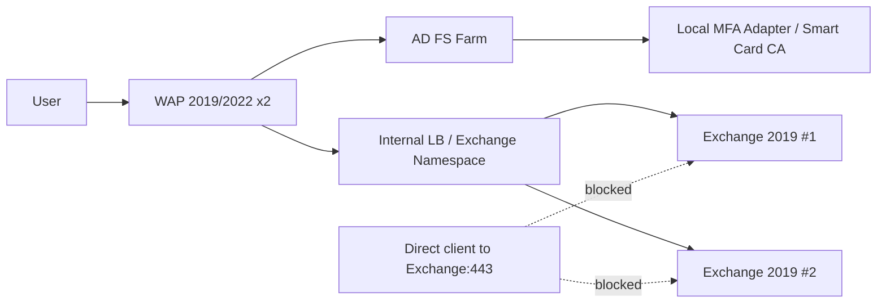

# Exchange Server 2019 OWA 真正 MFA（不可绕过）最佳实践实施方案

> 场景：两台 Exchange Server 2019，生产环境**不使用 Entra**，且 Exchange 所在环境**无外网访问权限**。

## 1. 关键结论（离线/本地化场景）

在“无 Entra、无公网依赖”的前提下，要实现 OWA 真正 MFA（不可绕过），推荐采用：

1. **AD FS + Web Application Proxy (WAP) 预认证**作为 OWA 唯一入口。
2. 在 AD FS 上启用**本地第二因子**（优先 Smart Card/证书，或本地 OTP MFA Adapter）。
3. Exchange 仅对内提供 OWA/ECP，网络层禁止任何客户端直连 Exchange 443。
4. Exchange IIS 和 Windows 防火墙只允许来自 WAP/LB 的源地址访问 OWA/ECP。

> 核心原则：MFA 必须发生在到达 Exchange 前（身份边界），并在网络路径上切断所有直连后门。

---

## 2. 推荐架构（纯本地）



---

## 3. 本地 MFA 技术选型（按安全优先级）

### A. 首选：AD + Smart Card（证书）

- 因子 1：AD 账户口令（或 Windows 集成认证策略）。
- 因子 2：用户证书/智能卡（本地 CA 签发）。
- 优点：完全离线、本地可控、抗钓鱼能力强（相对 OTP）。
- 要点：证书生命周期、吊销检查（CRL/OCSP）需高可用。

### B. 次选：AD FS + 本地 OTP MFA Adapter

- 因子 1：AD 口令。
- 因子 2：本地 OTP（硬件令牌或离线 TOTP 平台）。
- 适合无法大规模推证书的环境。

> 不建议：仅在 Exchange 上叠加自定义登录页验证码（容易被协议/路径绕过，且升级维护风险高）。

---

## 4. 生产实施步骤

## 4.1 Exchange 双机基线

1. 统一虚拟目录 URL 与证书策略。
2. 明确仅发布 OWA（以及必要时 ECP 管理入口）。
3. 清理外网不必要协议（EWS/ActiveSync/POP/IMAP/Autodiscover 外网路径按业务收敛）。

参考检查：

```powershell
Get-OwaVirtualDirectory | fl Server,InternalUrl,ExternalUrl,FormsAuthentication,BasicAuthentication
Get-EcpVirtualDirectory | fl Server,InternalUrl,ExternalUrl,BasicAuthentication
Get-MapiVirtualDirectory | fl Server,InternalUrl,ExternalUrl,IISAuthenticationMethods
Get-ActiveSyncVirtualDirectory | fl Server,InternalUrl,ExternalUrl,BasicAuthEnabled
```

## 4.2 部署 AD FS + WAP（高可用）

1. 部署至少 2 台 AD FS（域内）+ 2 台 WAP（DMZ/边界区）。
2. WAP 发布 OWA URL（外部用户仅访问 WAP 地址）。
3. WAP 对 OWA 启用 AD FS 预认证（而非纯透传）。
4. AD FS 全局策略中，对 OWA 发布应用强制 MFA。

## 4.3 AD FS 强制 MFA 策略

- 目标：OWA 发布应用（Relying Party/Application Group）。
- 条件：所有用户（仅保留受控 break-glass 账户，并限制来源网段 + 审计）。
- 授予：Require MFA。
- 建议：对高风险管理员单独策略（更短会话、更严格设备条件）。

## 4.4 反绕过（必须）

### 网络层

- Exchange 不暴露客户端可达入口。
- 仅允许 `WAP/LB -> Exchange:443`。
- DNS 不给客户端解析到 Exchange 实际地址。

### Exchange 主机层

- `/owa`、`/ecp` 仅允许 WAP/LB 源地址（IIS allowUnlisted=false）。
- Windows 防火墙 443 仅允许受信代理源。
- 视业务关闭/限制可被外部直接利用的遗留端点。

---

## 5. 仓库脚本

- `scripts/harden-owa-mfa.ps1`
  - 对 OWA/ECP 启用 IIS IP 白名单。
  - 配置 Windows 防火墙 443 仅允许受信源。
- `scripts/harden-exchange-auth.ps1`
  - 按“最小暴露”原则关闭外网不需要的认证/协议（示例模板，可按业务开关）。
- `scripts/validate-owa-mfa.ps1`
  - 验证 OWA/ECP 的 IIS IP 限制和 443 防火墙规则。

> 注意：脚本默认 CIDR 为示例文档地址，生产必须改成真实 WAP/LB 出口地址。

---

## 6. 上线验收

1. 访问 OWA 必须先到 AD FS 登录并触发第二因子。
2. 不满足 MFA 的用户无法进入 OWA。
3. 直连 Exchange IP:443 失败。
4. 非白名单源访问 Exchange:443 失败。
5. AD FS 审计、WAP 日志、Exchange IIS 日志可串联追踪。

---

## 7. 运维建议

- 变更后固定执行验证脚本。
- 季度复核 AD FS MFA 策略与例外账号。
- 证书/CRL/OCSP 监控纳入告警。
- 演练 WAP/AD FS 节点故障切换。
